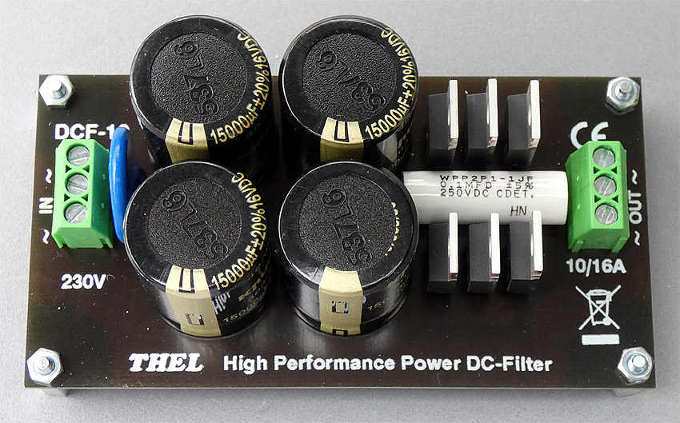

# Thel-DC-Filter
Thel DC-Filter DCF-6 and DCF-10  

DCF-6 and older DCF-10:  
https://web.archive.org/web/20190630164557/http://thel-audioworld.de/module/Netzfilter/DC-Filter.htm  

latest DCF-10:  
https://web.archive.org/web/20210514091444/http://thel-audioworld.de/module/Netzfilter/DC-Filter.htm  

used capacitors: Krummer 303EC ([krummer-kondensatoren.com](https://krummer-kondensatoren.com/))  
https://www.krummer-kondensatoren.de/wp-content/uploads/2014/03/303EC.pdf  

----  

### DCF-6:  
(6A cont. / 10A peak [short-time])    
Highest performance up to 2.2A (500W). Good values are also achieved up to 4.5A (1000W) if the DC voltage in the mains is not expected to be too high.  
  
This filter is therefore sufficient for most audio applications, e.g. for several small consumers such as preamplifiers, phono preamplifiers, CD players, music servers, record players, etc. Or just one or two power amplifiers.  
Electrolytic capacitors 18000µF/10A(Ripple)/60C°  
  
Dimensions: LxWxH = 110x46x34mm  
(height from lower edge of circuit board)  

----

### DCF-10:  
(10A cont. / 16A peak [short-time])  
A DC filter without performance limit up to 10A (2300W). It effectively blocks DC voltages up to the power limit of 10A.  
  
This is achieved by very high capacitance values, so that the diode voltage is not even reached during normal operation. The filter is also ideally suited to being installed centrally upstream of a larger circuit.  
Electrolytic capacitors 60000µ/20A(Ripple)/60C°  

Dimensions: LxWxH = 105x56x28mm  
(height from lower edge of circuit board)  

----

